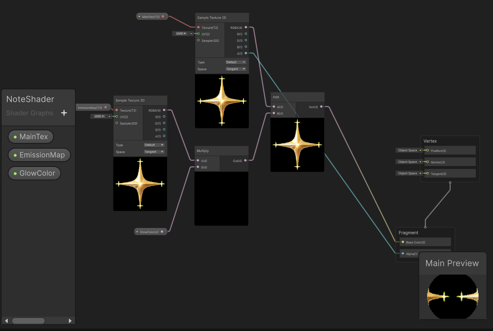

# GDIM 33 In-Class Activities
## W1
### Activity 1
1. My Moodboard

[Moodboard Link](https://docs.google.com/drawings/d/1X84hObsHi77y1mvDY4Q-7O0GRdMk-6aMNAHR06vlqzs/edit?usp=sharing)

2. Devlog Questions
- I am almost 100% committed to creating a rhythm game because it's my favorite genre of game. My initial inspiration on the game prototype is that: the rhythm game would blend the feeling of druming, have discernible VFX for different hitting types, and would hopefully be played on mobile. As for aesthetics, I included a lot of cute elements in the moodboard which I loved, and I might be working toward that direction (for the general aesthetics). 

- Chatted with table mate Averin and surprising found our shared interest in mobile rhythm games. This is encouraging for me in building my rhythm game and I would be happy to invite her to playtest my game throughout the development. 

- Discussed with LA Elijah! He didn't play much rhythm game but he thought my idea of a mobile rhythm game would be cool. 

### Activity 2

## W3
### Activity 1

### Activity 2
1. It's more advantageous to save the event name as a scene variable because it provides easy access to the event variable across different visual scripting graphs, rather than coder trying hard to memorize every event name they created. 

2. Using debug.log helps me to check that a specific node has been runned without struggling to observe both the scene play and the visual scripting graph at the same time (which could be hard on my screen). The linear progression of visual scripting graph also makes it certain that its previous node has been visited which is definitely helpful for efficient debugging. 

3. Set cursor lock state would be somehow relevant to my vertical slice because my current rhythm game operates based on player's keyboard input, without using the mouse. However, since my rhythm game is a 2D lock-screen game, player moving the cursor wouldn't actually affect the gameplay. Thus, it's a feature that's optional for me to implement. 

4. Certainly! The concept of game state would help me manage the switch of scene before game, during gameplay, and after gameplay (the result scene). It would also be another good usage of scripting state machine in my game. 

## W4
### Activity 1
For this current build, there's the basic layout of the in-game screen design (the star pattern) with combo text that won't update yet. The song starts when the game starts and could be paused (esc / p) or resumed (z). There's no music notes automatically coming out yet but pressing keyboard 1 ~ 7 would spawn notes on the stars respectively (for testing purpose)(visualize how golden star "float" out of the silver star lanes). The judgment system is also implemented but only work in engine (only debug.log hint for judgment result). 
My playtesting goals mostly centered around visual and experience feedback, including how player think about the "R, F, V, Space, I, J, N" finger position, how visually convincing is the "approaching" effect, and how visible are the music notes. 

Playtest Team: Ke-Chieh Chang (me), Jingyi Cheng, Jeremiah Yang, Brandon Tsay

Since there aren't really gameplay in my game, so I introduced to them about the features I've implemented for now (mostly as described above). For the finger position, they could see the logical intuition I'm trying to map with the star pattern to the keyboard, but they feel it's best for the key position to be customizable (which will be in the future). For the visual effect, they suggest to extend the silver star to the back to look like a "lane", and also adding some animation on both stars and the background to feel the "groove" better. Furthermore, I will certainly be adding visual guide on each of the star that writes the corresponding key mapping to them in order for player to explore and play the game on their own in the future, without guidance.

### Activity 2
1. Yes because the dialogue completely depends on the creation of scriptable object and their interconnection, which could be done in the editor. 
2. There's basically not a limit to the maximum number of nodes as long as it doesn't exceed what unity could afford. If there are too many branching options, it would still only be UI issue about the positioning of buttons, button size, or container adjustment. 
3. Regenerate nodes act as an initialization to all available visual scripting node options, including the default ones, and nodes for monobehaviour and scriptable object scripts branching options. It could also be used to initialize new nodes after adding them to the project setting. 

## W5
### Activity 1
I have already settled down the ScriptableObject for SongData that store the metadata and chart for a specific song. For the classtime, I will be implementing player interaction feedbacks for my game, specifically:
1. Star Lane Reaction for Keyboard Press:
- In the LaneController script, when the designated keycode for this lane is pressed, make the lane star scales down a little bit to indicate that it's being pressed
- make the lane restores its original scale when the keycode is detected up (GetKeyUp).
- Add a colored star outline behind the lanes that will be visible when the lane star is scaled down. 

### Activity 2
This visual feedback has took longer than I expected because I was trapped by the procedural logic in the update method. My lane visual method has to be called at the very top of the update so it could be executed before any other keycode detection logic that also stays in the update method of LaneController script. As a result, I got the lane star to pulse by using math.lerp to create its visual pulsing effect (smooth scaling up and down) when its designated key is pressed. However, I didn't have time to implement the colored lane background, but that would be easier than this coding logic. 

## W6
### Activity 1
Since the last build, I have implemented a simple chart for my song (20 music notes generated in a fixed eight-beats interval). The keyboard press is now visually observable, meaning that pressing a certain key will trigger the visual effect of that certain lane it's controlling. I have also implemented a minimal song selection menu. For my playtesting goals, I am simply looking for any general feedback on the user experience when playing the game. I am expecting some feedback on the note-hitting mechanics because it still needs some refinement and it might be offbeated for now because the offset is not customizable on built yet. Just want to get a general sense of how player would feel about this gameplay. 

Playtest Team: Ke-Chieh Chang (me), Jingyi Cheng, Jeremiah Yang, Brandon Tsay, TA Elijah

[Current Built link](https://cap0103.itch.io/33-rhythm-game-milestone-2)

I received several great constructive feedback from the playtesting! Some peers think the finger position is intuitive after actually playing and adapting to it. The most central thing I could work on next is the visual approach effect of the note. I did try to use some exponential growth equation when calculating the approach speed of the note, but it could feel a little confusing in term of when the note will actually "grow completely". Some peers suggest the note could be spawned starting at a 20% scale rather than a 0% scale so the approach could be more visible and natural. 

### Activity 2
1. Because the Blending node is directly multiplying the RGB value of both colors. When two floats smaller than 1 are multiplied, the final value becomes even smaller than the two floats which gives a darker color (closer to rgb black (0, 0, 0)). It's less saturated because the alpha has also diminished due to the same effect. 

2. More translucent, or more transparent because two floats smaller than one multiply to a smaller decimal number, which represents a more translucent alpha value. 

3. The UV value comes from the data stored in the vertex of the 3D mesh. 

4. Yes, because I might be able to create an iterative series of rgb combination using trigonemetry formula to oscillate each rgb value, generating some chaotic color visual effects. 

## W7
### Activity Devlog
1. The color comes from the normal vectors of the shiba's mesh model, where each normal vector's x, y, z mapped the r, g, b value of that specific point. 

2. This happens when the vertices of a triangle are consisted of different colors, which create the interpolated (blended) color fragments at the middle of this triangle. 

3. Because the material mainly defines how the mesh will be rendering through shader calculation without the providing specifically how its colored is mapped onto the mesh like texture does. However, material will be useful when rendering the low-poly objects in game that demands less of the details, which could be beneficial for game optimization. 

4. It looks perfect, great job modeling!

5. It could be used to debug the overall smoothness of the mesh model and check if there's any undesired pumps that might lead to weird rendering effect. 

6. It's because we're using directional light which is embodied by vectors that directly pointed toward the shiba mesh, which causes the dot product calculation to be opposite from what the intended effect is supposed to do. To solve this, we inverted the direction of the directional light before using it for fragment color calculation. 

7. By adding (suming) the value from color source to its destination value, we are making the brighter parts brighter and the darker part more darkened (rgb closer to 1), which is more desired in term of creating the fire effect. 

## W8
### Activity 1:
Since last milestone, I have adjusted how the star approaches by making it spins and having a smoother approaching velocity. I would like feedbacks centering around how the mechanics is more / less visual appealing or intuitive for the player. After playtested by two peers, the majority of the feedbacks centered around how the offset feels a little off which causes confusion at the timing of press. I received positive feedback about adding the spinning approach and labeling the stars with their keyboards. To improve the game, I will be constructing and adding the setting page for the game soon, which could be accessed before game and during game when the pause if pressed. In the setting page, I hope the offset to be adjustable, and also the approach speed. If possible, I would also like to make the keyboard position changable according to player's liking. 

### Activity 2:
1. The fraction node grab the decimal part of the input number. In this activity, it cooperate with the Time node and always read the amount of real time passed from it. As the time keep increases, the fraction node loops between 0.0-0.9 and goes on forever, creating the shiny (normal -> bright -> normal...) effect. 

2. Because the poof effect is supposed to brighten the dark environment. By adding the originally black default color to the poof shiny effect, it could then successfully function the brighten effect. 

3. Because the building texture isn't taken into consideration when actually rendering the sprite. It overrides the texture with the actual object's spriterenderer.

4. This is actually a math question. If we are multiplying the ShineSpeed to the fraction node, which output a value between 0.0-0.9, we are essentially limiting the range of the shiny effect, or exaggerating it. For example, multiplying a shine speed of 0.1 to the fraction node limits its output to be 0.0-0.09, which means that the change will be less obvious (instead of enhancing the shining speed). On the other hand, multiplying a shine speed of 2 to the fraction node expands its output range to be 0-2.0, which widen the range and makes the color changes more drastically, which still does not fulfill the purpose of changing shine speed. 

## W9
### Activity 1:
1. Minecraft

2.1. We are thinking about the purple-swirling effect that is triggered when the player is entering the Nether Portal. We anticipated this effect to be done through a full-screen post-processing effect that overlays on the screen as player is collising with the portal section (which could be a trigger collider), and the effect is disabled when player gets away with the portal section.

2.2. We also thinked about the bubbling effect around the object that used a potion. We anticipated this effect to be triggered when an item is collided in the range of the potion spray, which makes the bubbling effect starts popping up around that item in a certain interval of time and with a certain color depending on the type of potion. This is more like the particle rendering effect that's centered around the item that is being interacted. 

### Activity 2:

- I am still trying to implement the shader graph effect that makes the golden star's tips shiny, however, that has not worked out successfully yet. In today's class I did implement the full-screen post-processing effect that produce cinematic screen effect when a player hits perfectly on a note. 

